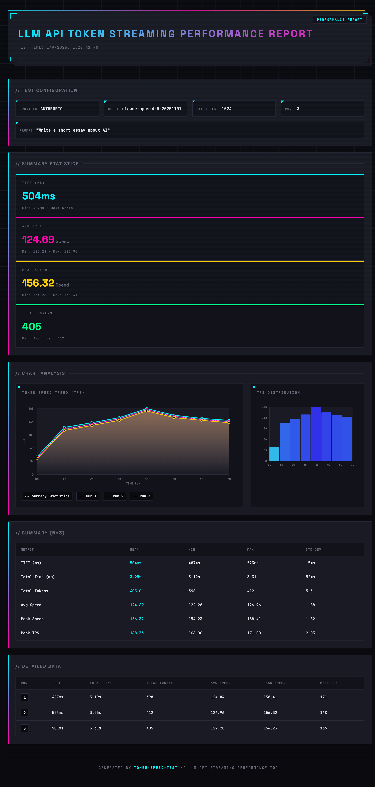

# Token Speed Tester

> A CLI tool to measure and analyze LLM API token streaming performance

[Chinese README](README.md)

[](https://www.npmjs.com/package/token-speed-tester)
[](https://opensource.org/licenses/MIT)
[](https://github.com/Cansiny0320/token-speed-tester/actions/workflows/ci.yml)

<p align="center">
  
</p>

A powerful command-line tool for testing token output speed of LLM APIs. Supports **Anthropic** and **OpenAI** compatible APIs, providing detailed metrics including TTFT (Time to First Token), throughput, peak speed, and statistical analysis across multiple runs.

## Features

- **Dual Protocol Support**: Works with Anthropic Messages API and OpenAI Chat Completions API
- **Streaming Performance**: Measures each token's arrival time with millisecond precision
- **Comprehensive Metrics**:
  - **TTFT** (Time to First Token): Latency before first token arrives
  - **Average Speed**: Mean tokens per second
  - **Peak Speed**: Fastest speed over a 10-token window
  - **Peak TPS**: Highest tokens received within a single second
  - **TPS Curve**: Tokens received per second throughout the stream
- **Statistical Analysis**: Mean, P50/P95/P99, min, and max across multiple test runs
- **ASCII Visualization**: Beautiful terminal-based charts and tables
- **HTML Report**: Generate interactive HTML reports with SVG charts
- **Custom Endpoints**: Test third-party APIs compatible with OpenAI/Anthropic protocols

## Installation

### Global Installation (Recommended)

```bash
npm install -g token-speed-tester
```

### Using npx (No Installation)

```bash
npx token-speed-tester --api-key sk-xxx
```

### Local Installation

```bash
npm install token-speed-tester
```

## Usage

### Basic Usage

```bash
# Test OpenAI API (default)
token-speed-tester --api-key sk-xxx
# English output
token-speed-tester --api-key sk-xxx --lang en
# Test Anthropic API
token-speed-tester --api-key sk-ant-xxx --provider anthropic
```

### Advanced Options

```bash
# Custom model and multiple test runs
token-speed-tester \
  --api-key sk-ant-xxx \
  --provider anthropic \
  --model claude-opus-4-5-20251101 \
  --runs 5

# Test with custom endpoint and prompt
token-speed-tester \
  --api-key sk-xxx \
  --provider openai \
  --url https://api.example.com/v1 \
  --model custom-model \
  --prompt "Explain quantum computing" \
  --max-tokens 2048 \
  --runs 10

# Generate HTML report (with SVG charts)
token-speed-tester \
  --api-key sk-ant-xxx \
  --output-format html \
  --output my-report.html

# Generate JSON report
token-speed-tester \
  --api-key sk-ant-xxx \
  --output-format json \
  --output report.json

# Generate CSV report
token-speed-tester \
  --api-key sk-ant-xxx \
  --output-format csv \
  --output report.csv

# Combined: Generate English HTML report
token-speed-tester \
  --api-key sk-ant-xxx \
  --runs 5 \
  --output-format html \
  -o performance-report.html \
  --lang en
```

### Local Development

```bash
# Clone and install dependencies
git clone https://github.com/Cansiny0320/token-speed-tester.git
cd token-speed-tester
npm install

# Run directly with tsx
npm run dev -- --api-key=sk-ant-xxx

# Or build and run
npm run build
node dist/index.mjs --api-key=sk-ant-xxx
```

## Command Line Options

| Option            | Short | Description                                   | Default                   |
| ----------------- | ----- | --------------------------------------------- | ------------------------- |
| `--api-key`       | `-k`  | API Key (required)                            | -                         |
| `--provider`      | `-p`  | API type: `anthropic` or `openai`             | `openai`                  |
| `--model`         | `-m`  | Model name                                    | Auto-selected by provider |
| `--url`           | `-u`  | Custom API endpoint                           | Official endpoint         |
| `--runs`          | `-r`  | Number of test runs                           | `3`                       |
| `--prompt`        |       | Test prompt                                   | Language-specific         |
| `--max-tokens`    |       | Maximum output tokens                         | `1024`                    |
| `--lang`          |       | Output language: `zh` or `en`                 | `zh`                      |
| `--output-format` | `-f`  | Output format: `terminal`/`json`/`csv`/`html` | `html`                    |
| `--output`        | `-o`  | Output file path (default `report.{ext}`)     | `report.{ext}`            |

Note: The default prompt follows the selected language. Use `--lang en` for the English default prompt.

### Default Models

- **Anthropic**: `claude-opus-4-5-20251101`
- **OpenAI**: `gpt-5.2`

## Output Example

```
Token Speed Test
--------------------------------------------------
Provider: openai
Model: gpt-5.2
Max Tokens: 1024
Runs: 3
Prompt: Write a short essay about AI
--------------------------------------------------
Running tests...
Model output (streaming):
[Run 1]
  TTFT: 523ms
  Total Time: 3245ms
  Total Tokens: 412
  Avg Speed: 126.96 tokens/s
  Peak Speed: 156.32 tokens/s
  Peak TPS: 168.00 tokens/s
[Run 2]
  TTFT: 487ms
  Total Time: 3189ms
  Total Tokens: 398
  Avg Speed: 124.84 tokens/s
  Peak Speed: 158.41 tokens/s
  Peak TPS: 171.00 tokens/s
[Run 3]
  TTFT: 501ms
  Total Time: 3312ms
  Total Tokens: 405
  Avg Speed: 122.28 tokens/s
  Peak Speed: 154.23 tokens/s
  Peak TPS: 166.00 tokens/s
======================================================================
Token Speed Test Report
======================================================================
Summary (N=3)
+-----------------------------------------------------------------------------------+
| Metric          |     Mean |      P50 |      P95 |      P99 |      Min |      Max |
+-----------------------------------------------------------------------------------+
| TTFT (ms)       |   503.67 |   501.00 |   520.00 |   523.00 |   487.00 |   523.00 |
| Total Time (ms) |  3248.67 |  3245.00 |  3312.00 |  3312.00 |  3189.00 |  3312.00 |
| Total Tokens    |   405.00 |   405.00 |   412.00 |   412.00 |   398.00 |   412.00 |
| Avg Speed       |   124.69 |   124.84 |   126.96 |   126.96 |   122.28 |   126.96 |
| Peak Speed      |   156.32 |   156.32 |   158.41 |   158.41 |   154.23 |   158.41 |
| Peak TPS        |   168.33 |   168.00 |   171.00 |   171.00 |   166.00 |   171.00 |
+-----------------------------------------------------------------------------------+
Token Speed Trend (TPS)
[chart omitted]
TPS Distribution
[histogram omitted]
Tests complete!

```

### HTML Report

Use the `--output-format html` option to generate a beautiful HTML report that includes:

- **Speed Trend Chart**: Multi-run speed curves with SVG animations
- **TPS Distribution**: Histogram of tokens per second
- **Summary Cards**: Key metrics like TTFT, average speed, peak speed
- **Detailed Data Table**: Complete data for each run
- **Responsive Design**: Works on desktop and mobile devices
- **Bilingual Support**: Automatically switches based on `--lang` setting

The report will automatically open in your browser after generation.

## Metrics Explained

| Metric            | Description                                                       |
| ----------------- | ----------------------------------------------------------------- |
| **TTFT**          | Time to First Token - latency from request to first token arrival |
| **Total Time**    | Complete duration from request to stream completion               |
| **Total Tokens**  | Number of output tokens received                                  |
| **Average Speed** | Mean tokens per second (totalTokens / totalTime x 1000)           |
| **Peak Speed**    | Fastest speed measured over a sliding 10-token window             |
| **Peak TPS**      | Highest tokens received within a single second                    |
| **TPS Curve**     | Tokens received per second throughout the streaming response      |

Note: Token counting uses the model tokenizer per stream chunk; boundary splits may cause slight differences.

## Development

### Running Tests

```bash
# Run tests
npm test

# Run tests with UI
npm run test:ui

# Generate coverage report
npm run test:coverage
```

### Building

```bash
npm run build
```

### Release

This project publishes to npm automatically via GitHub Actions. Release process:

1. Merge feature code to `master` branch
2. Create and push version tag:

```bash
# Patch release (bug fixes)
git tag v1.0.1
git push origin v1.0.1

# Minor release (new features)
git tag v1.1.0
git push origin v1.1.0

# Major release (breaking changes)
git tag v2.0.0
git push origin v2.0.0
```

After pushing the tag, GitHub Actions will automatically:
- Build the project
- Publish to npm
- Create GitHub Release

## Test Coverage

This project maintains high code coverage:

| Coverage Type | Percentage |
| ------------- | ---------- |
| Statements    | 98.69%     |
| Branches      | 93.48%     |
| Functions     | 100%       |

## License

MIT (c) [Cansiny0320](https://github.com/Cansiny0320)

## Contributing

Contributions are welcome! Please feel free to submit a Pull Request.

## Links

- [npm Package](https://www.npmjs.com/package/token-speed-tester)
- [GitHub Repository](https://github.com/Cansiny0320/token-speed-tester)
- [Issues](https://github.com/Cansiny0320/token-speed-tester/issues)
- [Changelog](https://github.com/Cansiny0320/token-speed-tester/blob/master/CHANGELOG.md)
