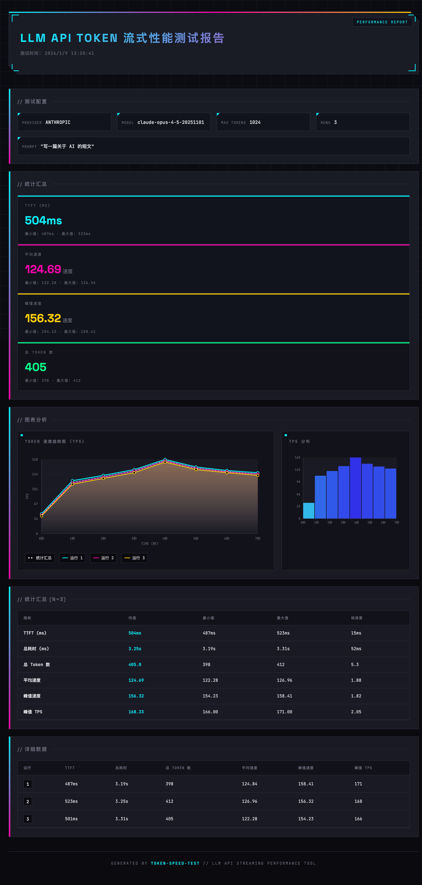

# Token 速度测试工具

> 用于测量和分析 LLM API Token 流式输出性能的命令行工具

[English](README.en.md)

[](https://www.npmjs.com/package/token-speed-tester)
[](https://opensource.org/licenses/MIT)
[](https://github.com/Cansiny0320/token-speed-tester/actions/workflows/ci.yml)

<p align="center">
  
</p>

一个强大的命令行工具，用于测试 LLM API 的 Token 输出速度。支持 **Anthropic** 和 **OpenAI** 兼容的 API，提供详细指标包括 TTFT（首字延迟）、吞吐量、峰值速度以及多次运行的统计分析。

## 特性

- **双协议支持**：兼容 Anthropic Messages API 和 OpenAI Chat Completions API
- **流式性能测量**：以毫秒级精度记录每个 Token 的到达时间
- **全面指标**：
  - **TTFT**（首字延迟）：首个 Token 到达前的延迟
  - **平均速度**：每秒平均 Token 数
  - **峰值速度**：10 个 Token 滑动窗口内的最快速度
  - **峰值 TPS**：单秒内的最高 Token 数
  - **TPS 曲线**：整个流式响应中每秒接收的 Token 数
- **统计分析**：多次测试运行的均值、P50/P95/P99、最小值和最大值
- **ASCII 可视化**：精美的终端图表和数据表格
- **HTML 报告**：生成包含 SVG 图表的交互式 HTML 报告
- **自定义端点**：测试兼容 OpenAI/Anthropic 协议的第三方 API

## 安装

### 全局安装（推荐）

```bash
npm install -g token-speed-tester
```

### 使用 npx（无需安装）

```bash
npx token-speed-tester --api-key sk-xxx
```

### 本地安装

```bash
npm install token-speed-tester
```

## 使用方法

### 基本用法

```bash
# 测试 OpenAI API（默认）
token-speed-tester --api-key sk-xxx
# 输出英文结果
token-speed-tester --api-key sk-xxx --lang en

# 测试 Anthropic API
token-speed-tester --api-key sk-ant-xxx --provider anthropic
```

### 高级选项

```bash
# 自定义模型和多次测试
token-speed-tester \
  --api-key sk-ant-xxx \
  --provider anthropic \
  --model claude-opus-4-5-20251101 \
  --runs 5

# 测试自定义端点和提示词
token-speed-tester \
  --api-key sk-xxx \
  --provider openai \
  --url https://api.example.com/v1 \
  --model custom-model \
  --prompt "解释量子计算" \
  --max-tokens 2048 \
  --runs 10

# 生成 HTML 报告（包含 SVG 图表）
token-speed-tester \
  --api-key sk-ant-xxx \
  --output-format html \
  --output my-report.html

# 生成 JSON 报告
token-speed-tester \
  --api-key sk-ant-xxx \
  --output-format json \
  --output report.json

# 生成 CSV 报告
token-speed-tester \
  --api-key sk-ant-xxx \
  --output-format csv \
  --output report.csv

# 组合使用：生成英文 HTML 报告
token-speed-tester \
  --api-key sk-ant-xxx \
  --runs 5 \
  --output-format html \
  -o performance-report.html \
  --lang en
```

### 本地开发

```bash
# 克隆并安装依赖
git clone https://github.com/Cansiny0320/token-speed-tester.git
cd token-speed-tester
npm install

# 使用 tsx 直接运行
npm run dev -- --api-key=sk-ant-xxx

# 或构建后运行
npm run build
node dist/index.mjs --api-key=sk-ant-xxx
```

## 命令行选项

| 选项              | 简写 | 说明                                     | 默认值                 |
| ----------------- | ---- | ---------------------------------------- | ---------------------- |
| `--api-key`       | `-k` | API Key（必填）                          | -                      |
| `--provider`      | `-p` | API 类型：`anthropic` 或 `openai`        | `openai`               |
| `--model`         | `-m` | 模型名称                                 | 根据提供商自动选择     |
| `--url`           | `-u` | 自定义 API 端点                          | 官方端点               |
| `--runs`          | `-r` | 测试次数                                 | `3`                    |
| `--prompt`        |      | 测试提示词                               | "写一篇关于 AI 的短文" |
| `--max-tokens`    |      | 最大输出 Token 数                        | `1024`                 |
| `--lang`          |      | 输出语言: `zh` 或 `en`                   | `zh`                   |
| `--output-format` | `-f` | 输出格式：`terminal`/`json`/`csv`/`html` | `html`                 |
| `--output`        | `-o` | 输出文件路径（默认 `report.{ext}`）      | `report.{ext}`         |

### 默认模型

- **Anthropic**: `claude-opus-4-5-20251101`
- **OpenAI**: `gpt-5.2`

## 输出示例

```
🚀 Token 速度测试工具
──────────────────────────────────────────
Provider: openai
Model: gpt-5.2
Max Tokens: 1024
Runs: 3
Prompt: 写一篇关于 AI 的短文
──────────────────────────────────────────

⏳ 正在运行测试...

模型输出 (流式):

[运行 1]
  TTFT: 523ms
  总耗时: 3245ms
  总 Token 数: 412
  平均速度: 126.96 tokens/s
  峰值速度: 156.32 tokens/s
  峰值 TPS: 168.00 tokens/s

[运行 2]
  TTFT: 487ms
  总耗时: 3189ms
  总 Token 数: 398
  平均速度: 124.84 tokens/s
  峰值速度: 158.41 tokens/s
  峰值 TPS: 171.00 tokens/s

[运行 3]
  TTFT: 501ms
  总耗时: 3312ms
  总 Token 数: 405
  平均速度: 122.28 tokens/s
  峰值速度: 154.23 tokens/s
  峰值 TPS: 166.00 tokens/s

======================================================================
Token 速度测试报告
======================================================================

统计汇总 (N=3)
┌──────────────────────────────────────────────────────────────────────┐
│ 指标             │       均值 │      P50 │      P95 │      P99 │    最小值 │    最大值 │
├──────────────────────────────────────────────────────────────────────┤
│ TTFT (ms)       │    503.67 │   501.00 │   520.00 │   523.00 │   487.00 │   523.00 │
├──────────────────────────────────────────────────────────────────────┤
│ 总耗时 (ms)      │   3248.67 │  3245.00 │  3312.00 │  3312.00 │  3189.00 │  3312.00 │
├──────────────────────────────────────────────────────────────────────┤
│ 总 Token 数     │    405.00 │   405.00 │   412.00 │   412.00 │   398.00 │   412.00 │
├──────────────────────────────────────────────────────────────────────┤
│ 平均速度        │    124.69 │   124.84 │   126.96 │   126.96 │   122.28 │   126.96 │
├──────────────────────────────────────────────────────────────────────┤
│ 峰值速度        │    156.32 │   156.32 │   158.41 │   158.41 │   154.23 │   158.41 │
├──────────────────────────────────────────────────────────────────────┤
│ 峰值 TPS         │    168.33 │   168.00 │   171.00 │   171.00 │   166.00 │   171.00 │
└──────────────────────────────────────────────────────────────────────┘

Token 速度趋势图 (TPS)
┌────────────────────────────────────────┐
│ 120 ┤                         █         │
│ 100 ┤                     █ █ █ █       │
│  80 ┤                 █ █ █ █ █ █ █     │
│  60 ┤             █ █ █ █ █ █ █ █ █ █   │
│  40 ┤         █ █ █ █ █ █ █ █ █ █ █ █   │
│  20 ┤     █ █ █ █ █ █ █ █ █ █ █ █ █ █   │
│   0 └────────────────────────────────── │
│     0s   1s   2s   3s   4s   5s   6s    │
└────────────────────────────────────────┘

TPS 分布
0.0-12.0 │██████████████████████████████████████████████████ 45
12.0-24.0 │██ 3
24.0-36.0 │ 0
36.0-48.0 │ 0
48.0-60.0 │ 0
60.0-72.0 │ 0
72.0-84.0 │ 0
84.0-96.0 │ 0
96.0-108.0 │ 0
108.0-120.0 │ 0

✅ 测试完成!
```

### HTML 报告

使用 `--output-format html` 选项可以生成精美的 HTML 报告，报告包含：

- **速度趋势图**：多条运行的速度曲线对比（SVG 动画）
- **TPS 分布图**：每秒 Token 数的直方图
- **统计汇总卡片**：TTFT、平均速度、峰值速度等核心指标
- **详细数据表格**：每次运行的完整数据
- **响应式设计**：支持桌面和移动设备
- **中英文支持**：根据 `--lang` 自动切换

报告生成后会自动在浏览器中打开。

## 指标说明

| 指标            | 说明                                                |
| --------------- | --------------------------------------------------- |
| **TTFT**        | 首字延迟 - 从请求到首个 Token 到达的时间            |
| **总耗时**      | 从请求到流式响应完成的完整时长                      |
| **总 Token 数** | 接收到的输出 Token 数量                             |
| **平均速度**    | 每秒平均 Token 数（totalTokens / totalTime × 1000） |
| **峰值速度**    | 10 个 Token 滑动窗口内测量的最快速度                |
| **峰值 TPS**    | 单秒内最高 Token 数                                 |
| **TPS 曲线**    | 整个流式响应中每秒接收的 Token 数                   |

注：Token 统计基于模型 tokenizer，并按流式分片计数，分片边界可能带来轻微差异。

## 开发

### 运行测试

```bash
# 运行测试
npm test

# 使用 UI 运行测试
npm run test:ui

# 生成覆盖率报告
npm run test:coverage
```

### 构建

```bash
npm run build
```

### 发布

本项目通过 GitHub Actions 自动发布到 npm。发布流程：

1. 合并功能代码到 `master` 分支
2. 创建并推送版本 tag：

```bash
# 补丁版本 (bug 修复)
git tag v1.0.1
git push origin v1.0.1

# 次要版本 (新功能)
git tag v1.1.0
git push origin v1.1.0

# 主要版本 (破坏性变更)
git tag v2.0.0
git push origin v2.0.0
```

推送 tag 后，GitHub Actions 会自动：
- 构建项目
- 发布到 npm
- 创建 GitHub Release

## 测试覆盖率

本项目保持高代码覆盖率：

| 覆盖率类型 | 百分比 |
| ---------- | ------ |
| 语句覆盖率 | 98.69% |
| 分支覆盖率 | 93.48% |
| 函数覆盖率 | 100%   |

## 开源协议

MIT © [Cansiny0320](https://github.com/Cansiny0320)

## 贡献

欢迎贡献！请随时提交 Pull Request。

## 相关链接

- [npm 包](https://www.npmjs.com/package/token-speed-tester)
- [GitHub 仓库](https://github.com/Cansiny0320/token-speed-tester)
- [问题反馈](https://github.com/Cansiny0320/token-speed-tester/issues)
- [更新日志](https://github.com/Cansiny0320/token-speed-tester/blob/master/CHANGELOG.md)
